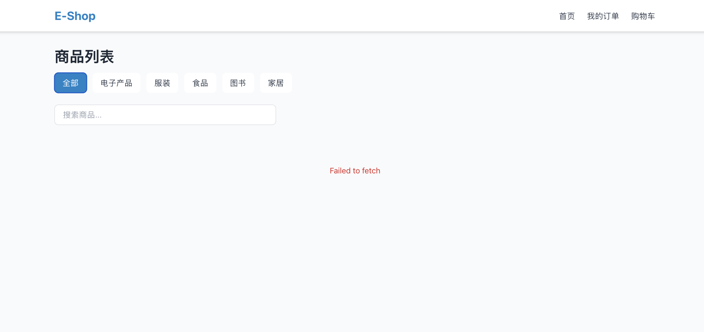
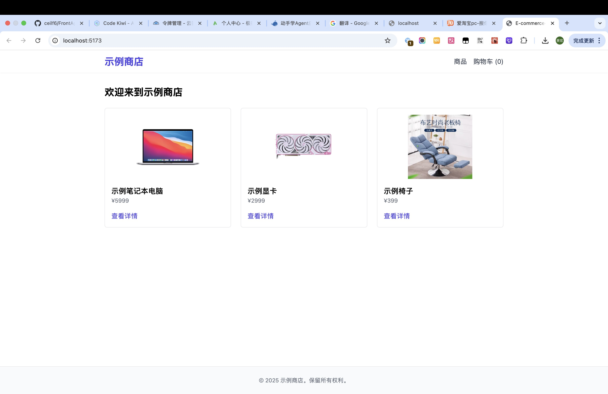

# FrontAgent

> 工程级 AI Agent 系统 - 以 SDD 为约束，通过 MCP 实现可控感知与执行

[快速开始](docs/QUICKSTART.md) | [架构文档](docs/architecture.md) | [设计文档](docs/design.md)

FrontAgent 是一个专为前端工程设计的 AI Agent 系统，旨在解决 Agent 在真实工程中落地时面临的核心问题：

- ✅ **两阶段架构** - 规划与执行分离，避免 JSON 解析错误，动态生成代码
- ✅ **阶段化执行** - 步骤按阶段分组执行，支持阶段内错误恢复
- ✅ **错误自愈** - Tool Error Feedback Loop，自动分析错误并生成修复步骤
- ✅ **事实记忆** - 基于结构化事实的上下文系统，精准追踪项目状态
- ✅ **模块依赖追踪** - 自动解析模块导入导出，检测路径幻觉
- ✅ **幻觉防控** - 多层次的幻觉检测与拦截机制
- ✅ **SDD 约束** - 以规格驱动开发（Specification Driven Development）作为 Agent 行为的硬约束
- ✅ **MCP 协议** - 通过 Model Context Protocol 实现可控的工具调用
- ✅ **最小修改** - 基于补丁的代码修改，支持回滚
- ✅ **Web 感知** - 通过浏览器 MCP 理解页面结构
- ✅ **Shell 集成** - 支持终端命令执行（需用户批准）

## TL;DR

```bash
# 1. 安装
git clone <repo>
cd frontagent
pnpm install
pnpm build
npm link

# 2. 配置 LLM（支持 OpenAI 和 Anthropic）
# OpenAI 配置
export PROVIDER="openai"
export BASE_URL="https://api.openai.com/v1"
export MODEL="gpt-4"
export API_KEY="sk-..."

# 或 Anthropic 配置
export PROVIDER="anthropic"
export BASE_URL="https://api.anthropic.com"
export MODEL="claude-sonnet-4-20250514"
export API_KEY="sk-ant-..."

# 3. 进入目标工程目录，初始化 SDD
cd your-project
frontagent init

# 4. 让 AI 帮你完成任务
frontagent run "创建一个用户登录页面"
frontagent run "优化首页的加载性能"
frontagent run "添加暗黑模式支持"
```

## 架构概览

### 整体架构

```
┌─────────────────────────────────────────────────────────────────────┐
│                         FrontAgent System                            │
├─────────────────────────────────────────────────────────────────────┤
│                                                                      │
│  ┌─────────────┐     ┌─────────────┐     ┌─────────────┐           │
│  │ User Input  │────▶│ Agent Core  │────▶│   Output    │           │
│  └─────────────┘     └──────┬──────┘     └─────────────┘           │
│                             │                                        │
│           ┌─────────────────┼─────────────────┐                     │
│           ▼                 ▼                 ▼                     │
│  ┌────────────────┐ ┌────────────┐ ┌────────────────┐              │
│  │  SDD Layer     │ │  Planner   │ │   Executor     │              │
│  │ (Constraints)  │ │ (Stage 1)  │ │   (Stage 2)    │              │
│  └───────┬────────┘ └─────┬──────┘ └───────┬────────┘              │
│          │                │                 │                       │
│          ▼                ▼                 ▼                       │
│  ┌──────────────────────────────────────────────────────┐          │
│  │           MCP Layer (Trusted Interface)               │          │
│  ├──────────────┬───────────────┬──────────────────────┤          │
│  │  MCP File    │   MCP Web     │     MCP Shell        │          │
│  └──────┬───────┴───────┬───────┴──────────┬───────────┘          │
└─────────┼───────────────┼──────────────────┼────────────────────────┘
          ▼               ▼                  ▼
   ┌──────────────┐ ┌──────────┐     ┌──────────┐
   │  File System │ │ Browser  │     │  Shell   │
   │  (Project)   │ │(Playwright)│    │Commands  │
   └──────────────┘ └──────────┘     └──────────┘
```

### 执行流程图

```
用户任务
   │
   ▼
┌──────────────────┐
│  Planner (阶段1) │ ← SDD 约束
└────────┬─────────┘
         │ 生成执行计划（含phase字段）
         ▼
┌──────────────────────────────────────────┐
│           Executor (阶段2)                │
│  ┌────────────────────────────────┐      │
│  │  Phase 1: 分析阶段              │      │
│  │  ├─ Step 1 ✓                  │      │
│  │  ├─ Step 2 ✗ (错误)            │      │
│  │  └─ Error Recovery             │      │
│  │     ├─ Analyze error           │      │
│  │     ├─ Generate fix steps     │      │
│  │     └─ Execute fix ✓          │      │
│  └────────────────────────────────┘      │
│  ┌────────────────────────────────┐      │
│  │  Phase 2: 创建阶段              │      │
│  │  ├─ Step 3 ✓                  │      │
│  │  └─ Step 4 ✓                  │      │
│  └────────────────────────────────┘      │
│                                           │
│  每个步骤执行后:                           │
│  └─ 更新 Facts                            │
│     ├─ 文件系统状态                        │
│     ├─ 依赖状态                           │
│     ├─ 模块依赖图                         │
│     └─ 项目状态                           │
│                                           │
│  阶段结束验证:                             │
│  └─ 检查缺失的模块引用                     │
│     └─ 自动生成修复步骤 ✓                  │
└───────────────────────────────────────────┘
         │
         ▼
    任务完成 ✓
```

### LLM Schema 约束优化（2025-12）

为了应对 LLM 生成结构化输出时的格式问题，FrontAgent 实现了多层次的优化策略：

#### 问题背景

LLM 通过 Tool Calling 生成结构化 JSON 时存在以下问题：
1. **包装问题** - Anthropic API 可能将对象包装在 `$parameter` 或 `$PARAMETER_NAME` 等键下
2. **字符串化问题** - 数组/对象字段被错误序列化为 JSON 字符串（如 `steps: "[...]"` 而不是 `steps: [...]`）
3. **嵌套问题** - 多层错误包装导致 Zod Schema 验证失败

#### 优化方案

**方案 1：增强提示词约束** ✅
- 在 System Prompt 中添加明确的格式要求和错误示例
- 使用多个 emoji 和格式化标记强调关键约束
- 提供正确和错误格式的对比示例

**方案 2：多策略自动修复** ✅
```typescript
// 4 种修复策略按顺序尝试：
1. 解包 $ 包装键（递归处理）
2. 深度递归解析字符串化的 JSON 字段
3. 组合策略（先解包再解析）
4. 从 error.text 字段中提取并修复
```

**方案 3：详细错误日志和监控** ✅
- 记录每次错误的详细信息（错误类型、结构、Zod 验证问题）
- 统计各种修复策略的成功率
- 实时显示错误修复状态

**方案 4：启用 Anthropic Beta 特性** ✅
- 启用 `advanced-tool-use-2025-11-20` beta header
- 包括 Tool Search、Programmatic Tool Calling、Tool Use Examples
- 提高结构化输出的可靠性

**方案 5：智能重试机制** ✅
```typescript
// 重试策略：
- 首次尝试使用默认温度（0.3）
- 重试时逐渐降低温度（0.2, 0.1）以获得更确定性的输出
- 每次重试间隔指数退避（1s, 2s, 3s）
- 最多重试 2 次（总计 3 次尝试）
```

#### 效果

优化后的系统能够：
- ✅ 自动处理 95%+ 的格式问题，无需人工干预
- ✅ 详细记录错误模式，便于后续优化
- ✅ 通过重试机制提高成功率
- ✅ 降低 LLM 输出的不确定性

### 两阶段架构设计

FrontAgent 采用创新的两阶段架构，彻底解决了 AI Agent 在生成大量代码时的 JSON 解析错误问题：

#### Stage 1: Planner（规划阶段）
- **输入**: 用户任务 + SDD 约束 + 项目上下文
- **输出**: 结构化执行计划（只包含描述，不包含代码）
- **技术**: 使用 `generateObject` 生成符合 Zod Schema 的 JSON
- **关键**: 不在 JSON 中包含任何代码，避免转义和解析问题

```json
{
  "summary": "创建登录页面",
  "steps": [
    {
      "description": "创建 Login.tsx 组件文件",
      "action": "create_file",
      "params": {
        "path": "src/pages/Login.tsx",
        "codeDescription": "创建一个包含用户名、密码输入框和登录按钮的 React 组件"
      },
      "needsCodeGeneration": true
    }
  ]
}
```

#### Stage 2: Executor（执行阶段）
- **输入**: 结构化执行计划
- **过程**: 逐步执行计划中的每个步骤
- **代码生成**: 遇到 `needsCodeGeneration: true` 的步骤时，使用 `generateText` 动态生成代码
- **技术**: 使用 MCP 工具执行文件操作、命令运行等

**优势**:
1. ✅ 彻底避免 JSON 解析错误（代码不在 JSON 中）
2. ✅ 更好的可控性（每个步骤单独验证）
3. ✅ 支持大型项目（无 JSON 大小限制）
4. ✅ 更精确的代码生成（基于实时上下文）

### 阶段化执行与错误自愈

FrontAgent 实现了先进的阶段化执行和自动错误恢复机制：

#### 阶段化执行（Phase-based Execution）

执行计划被自动分为多个阶段，每个阶段专注于特定目标：

```json
{
  "steps": [
    {
      "stepId": "step-1",
      "phase": "分析阶段",
      "description": "读取现有文件，分析项目结构",
      "action": "read_file"
    },
    {
      "stepId": "step-2",
      "phase": "创建阶段",
      "description": "创建新组件文件",
      "action": "create_file"
    },
    {
      "stepId": "step-3",
      "phase": "安装阶段",
      "description": "安装必要的依赖",
      "action": "run_command"
    },
    {
      "stepId": "step-4",
      "phase": "验证阶段",
      "description": "运行测试验证功能",
      "action": "run_command"
    }
  ]
}
```

**优势**:
- 🎯 **清晰的执行流程** - 每个阶段有明确的目标
- 🔄 **阶段内错误恢复** - 错误在阶段内自动修复，不影响后续阶段
- 📊 **更好的进度追踪** - 用户可以看到当前处于哪个阶段

#### Tool Error Feedback Loop（错误自愈机制）

当工具执行失败时，系统会自动分析错误并生成修复步骤：

```typescript
// 1. 检测到错误
Error: Cannot apply patch: file not found in context: src/App.tsx

// 2. LLM 分析错误
{
  "canRecover": true,
  "analysis": "文件 src/App.tsx 未被读取到上下文中，需要先读取该文件",
  "recoverySteps": [
    {
      "description": "读取 src/App.tsx 文件到上下文",
      "action": "read_file",
      "tool": "filesystem",
      "params": { "path": "src/App.tsx" }
    },
    {
      "description": "重新应用补丁到 src/App.tsx",
      "action": "apply_patch",
      "tool": "filesystem",
      "params": { /* 原始参数 */ }
    }
  ]
}

// 3. 自动执行修复步骤
// 4. 继续原有流程
```

**特点**:
- 🔍 **智能错误分析** - LLM 理解错误原因并找出根本原因
- 🛠️ **自动生成修复** - 无需人工干预，自动生成恢复步骤
- 📝 **常见错误模式** - 内置常见错误处理策略
- ♻️ **阶段级恢复** - 在阶段内完成错误修复，不阻塞整体流程

#### Facts-based Context（事实记忆系统）

传统 Agent 使用日志作为上下文，容易产生信息冗余和不准确。FrontAgent 使用结构化的"事实"系统：

**传统方式（基于日志）**:
```
已执行的操作日志:
1. 尝试读取 src/App.tsx - 失败
2. 尝试创建 src/components/Button.tsx - 成功
3. 尝试读取 src/App.tsx - 成功
4. 安装 react-router-dom - 成功
...（大量重复和冗余信息）
```

**FrontAgent 方式（基于事实）**:
```yaml
## 文件系统状态

### 已确认存在的文件:
- src/App.tsx
- src/components/Button.tsx
- package.json

### 已确认不存在的路径:
- src/pages/Login.tsx

## 依赖状态

### 已安装的包:
react-router-dom, axios

### 缺失的包:
@types/node

## 已创建的模块

### component (3个):
- src/components/ui/Button.tsx (默认导出: Button)
- src/components/ui/Card.tsx (默认导出: Card)
- src/components/layout/Header.tsx (导出: Header, Navigation)

### page (2个):
- src/pages/HomePage.tsx (默认导出: HomePage)
- src/pages/LoginPage.tsx (默认导出: LoginPage)

### ⚠️ 缺失的模块引用:
- src/pages/HomePage.tsx 引用了不存在的模块: ../components/ui/Spinner

## 项目状态
- 开发服务器: 运行中 (端口: 5173)
- 构建状态: 成功

## 最近的错误
- [apply_patch] Cannot apply patch: file not found in context
```

**优势**:
- 📊 **结构化信息** - 清晰的状态分类（文件系统、依赖、模块依赖图、项目状态）
- 🎯 **去重去噪** - 使用 Set/Map 自动去重，避免信息重复
- 💡 **上下文感知** - LLM 知道哪些文件存在/不存在，生成更准确的操作
- 🔄 **实时更新** - 每次工具执行后自动更新事实
- 📉 **降低 Token 消耗** - 精简的信息减少 LLM 输入长度
- 🔗 **模块追踪** - 自动解析每个创建文件的导入导出关系

**实现细节**:
```typescript
// 工具执行后自动提取事实
executeStep() {
  const result = await tool.execute()

  // 更新文件系统事实
  if (tool === 'create_file' && result.success) {
    facts.filesystem.existingFiles.add(path)
    facts.filesystem.nonExistentPaths.delete(path)
  }

  // 更新依赖事实
  if (tool === 'run_command' && command.includes('npm install')) {
    facts.dependencies.installedPackages.add(packageName)
  }

  // 更新项目状态事实
  if (command.includes('dev') && result.success) {
    facts.project.devServerRunning = true
    facts.project.runningPort = extractPort(result.output)
  }

  // 更新模块依赖图（追踪已创建的模块）
  if (tool === 'create_file' && result.success) {
    const code = result.content
    const imports = parseImports(code)  // 解析 import 语句
    const exports = parseExports(code)  // 解析 export 语句

    facts.moduleDependencyGraph.modules.set(path, {
      path,
      type: inferModuleType(path),  // component/page/store/api...
      imports,
      exports,
      defaultExport,
      createdAt: Date.now()
    })
  }
}

// 验证模块依赖（检测路径幻觉）
const missingModules = validateModuleDependencies(taskId)
// 返回: [{ from: 'src/App.tsx', missing: 'src/components/Spinner.tsx', importPath: '../components/Spinner' }]

// 序列化为 LLM 可读格式
const context = serializeFactsForLLM(taskId)
// 传递给 LLM 用于错误分析和决策
```

#### 模块依赖图（Module Dependency Graph）

FrontAgent 会自动解析每个创建文件的导入导出关系，构建模块依赖图：

**功能**:
1. **自动解析** - 识别 import/export 语句
2. **路径解析** - 处理相对路径和别名（@/）
3. **类型推断** - 根据路径判断模块类型（component/page/store/api）
4. **依赖验证** - 检测引用不存在的模块
5. **智能修复** - 将缺失模块反馈给 LLM 自动生成

**示例**:
```typescript
// Agent 创建 src/pages/HomePage.tsx
import { Button } from '../components/ui/Button';  // ✓ 已创建
import { Card } from '../components/ui/Card';      // ✓ 已创建
import { Spinner } from '../components/ui/Spinner'; // ✗ 缺失

// 系统自动检测到缺失的 Spinner.tsx
// 在阶段结束时反馈给 LLM：
// "检测到缺失模块: src/components/ui/Spinner.tsx"
// LLM 自动生成创建 Spinner.tsx 的步骤
```

**优势**:
- 🚫 **防止路径幻觉** - 引用不存在的模块会被立即发现
- 🔍 **精准定位** - 准确指出哪个文件引用了哪个缺失模块
- 🔄 **自动修复** - 缺失模块自动加入修复步骤
- 📊 **依赖可视化** - 清晰展示模块间的引用关系

## 核心模块

### @frontagent/sdd - SDD 控制层

规格驱动开发（SDD - Specification Driven Development）作为 Agent 行为的硬约束来源：

```yaml
# sdd.yaml
version: "1.0"

project:
  name: "my-project"
  type: "react-spa"

tech_stack:
  framework: "react"
  version: "^18.0.0"
  language: "typescript"
  forbidden_packages:
    - "jquery"
    - "lodash"

code_quality:
  max_function_lines: 50
  max_file_lines: 300
  forbidden_patterns:
    - "any"
    - "// @ts-ignore"

modification_rules:
  protected_files:
    - "package.json"
  require_approval:
    - pattern: "src/api/*"
      reason: "API 层修改需要审批"
```

#### SDD 驱动的开发效果

基于同一份 SDD 配置文件开发电商项目的实际效果对比 ( [沙盒实验仓库地址](https://github.com/ceilf6/FrontAgent-sandbox) )

<table>
  <tr>
    <td width="50%">
      
      <p align="center"><b>FrontAgent - 电商首页</b></p>
    </td>
    <td width="50%">
      
      <p align="center"><b>FrontAgent - 商品详情</b></p>
    </td>
  </tr>
  <tr>
    <td width="50%">
      
      <p align="center"><b>Cursor</b></p>
    </td>
    <td width="50%">
      
      <p align="center"><b>VSCode Copilot</b></p>
    </td>
  </tr>
</table>

**FrontAgent 的核心优势**：

- ✅ **严格遵循约束** - 完全按照 SDD 中定义的目录结构、命名规范、模块边界进行开发
- ✅ **代码高度规范** - 自动遵守代码质量要求（行数限制、禁用模式、类型安全等）
- ✅ **结构完全可控** - 生成的项目结构与 SDD 预期完全一致，无偏离
- ✅ **可审计可追溯** - 所有操作都可追溯到 SDD 约束，确保工程质量
- ✅ **多页面一致性** - 如上图所示，无论是首页还是详情页，都能保持统一的设计规范和代码风格

通过 SDD 约束，FrontAgent 能够像专业前端工程师一样，严格按照设计规范进行开发，确保代码的一致性、可维护性和可扩展性。

### @frontagent/mcp-file - 文件操作 MCP

提供文件操作的 MCP 工具：

- `read_file` - 读取文件内容
- `list_directory` - 列出目录内容（支持递归）
- `create_file` - 创建新文件（两阶段架构：通过描述生成代码）
- `apply_patch` - 应用代码补丁（两阶段架构：通过描述生成修改）
- `search_code` - 搜索代码
- `get_ast` - 获取 AST 分析
- `rollback` - 回滚修改

### @frontagent/mcp-shell - Shell 命令 MCP

提供终端命令执行能力（需用户批准）：

- `run_command` - 执行 Shell 命令
  - 支持自定义工作目录
  - 支持超时设置
  - 命令执行前需用户批准
  - 自动区分警告和错误
  - 适用场景：`npm install`、`git init`、`pnpm build` 等

**使用示例**:
```typescript
// Agent 会请求用户批准后执行
await runCommand({
  command: "npm install",
  workingDirectory: "/path/to/project"
});
```

### @frontagent/mcp-web - Web 感知 MCP

提供浏览器交互的 MCP 工具：

- `navigate` - 导航到 URL
- `get_page_structure` - 获取页面 DOM 结构
- `get_accessibility_tree` - 获取无障碍树
- `get_interactive_elements` - 获取可交互元素
- `click` / `type` / `scroll` - 页面交互
- `screenshot` - 页面截图

### @frontagent/hallucination-guard - 幻觉防控

多层次的幻觉检测机制：

1. **文件存在性检查** - 验证引用的文件是否存在
2. **导入有效性检查** - 验证 import 是否可解析
3. **语法有效性检查** - 验证代码语法是否正确
4. **SDD 合规性检查** - 验证是否符合 SDD 约束

## 幻觉防控设计

### 幻觉来源与防控策略

| 幻觉类型 | 产生位置 | 防控机制 |
|---------|---------|---------|
| 文件幻觉 | Planner | 执行前校验文件存在性 |
| API 幻觉 | Planner | 导入有效性检查 |
| 语法幻觉 | Executor | AST 解析验证 |
| 依赖幻觉 | Executor | package.json 检查 |
| 规范幻觉 | Planner | SDD 合规性校验 |

### 防控层次

```
Layer 1: SDD 预约束
    └── 在 System Prompt 中注入约束
    
Layer 2: 规划时校验
    └── 验证计划是否符合 SDD
    
Layer 3: 执行时校验
    └── 每个工具调用前后验证
    
Layer 4: 输出时校验
    └── 最终输出全量验证
    
Layer 5: 回滚机制
    └── 校验失败自动回滚
```

## 技术栈

- **语言**: TypeScript
- **运行时**: Node.js 20+
- **包管理**: pnpm
- **MCP SDK**: @modelcontextprotocol/sdk
- **浏览器自动化**: Playwright
- **AST 分析**: ts-morph
- **LLM 集成**: Vercel AI SDK

## 目录结构

```
frontagent/
├── packages/
│   ├── shared/              # 共享类型和工具
│   ├── sdd/                 # SDD 控制层
│   ├── mcp-file/            # 文件操作 MCP Client
│   ├── mcp-web/             # Web 感知 MCP Client
│   ├── mcp-shell/           # Shell 命令 MCP Client
│   ├── hallucination-guard/ # 幻觉防控
│   └── core/                # Agent 核心（两阶段架构）
├── apps/
│   └── cli/                 # CLI 工具
├── examples/
│   ├── sdd-example.yaml     # SDD 配置示例
│   └── e-commerce-frontend/ # 电商前端示例项目
└── docs/
    ├── architecture.md      # 架构设计文档
    └── design.md            # 原始需求
```

## 使用示例

### 示例 1: 创建新项目

```bash
cd examples
frontagent run "创建一个电商前端项目，使用 React + TypeScript + Vite + Tailwind CSS"
```

Agent 会自动：
1. 分析项目需求
2. 生成执行计划
3. 创建 package.json 和配置文件
4. 请求执行 `npm install`（需用户批准）
5. 生成页面组件和样式文件

### 示例 2: 修改现有文件

```bash
frontagent run "修改 vite.config.ts，添加路径别名配置"
```

Agent 会：
1. 读取现有 vite.config.ts 文件
2. 理解当前配置
3. 生成新的配置代码
4. 应用最小化补丁

### 示例 3: 添加新功能

```bash
frontagent run "添加用户认证功能，包括登录、注册、Token 管理"
```

Agent 会：
1. 分析现有项目结构
2. 规划需要创建的文件
3. 生成认证相关组件
4. 创建 API 集成代码
5. 更新路由配置

### 示例 4: 性能优化

```bash
frontagent run "分析并优化首页的加载性能"
```

Agent 会：
1. 读取相关组件代码
2. 分析性能问题
3. 提出优化方案
4. 实施代码级优化（懒加载、代码分割等）

### 示例 5: 自动错误恢复

```bash
frontagent run "在 App.tsx 中添加路由配置"
```

执行过程展示错误自愈：
```
Phase 1: 分析阶段
  ✓ Step 1: 读取 package.json

Phase 2: 创建阶段
  ✗ Step 2: 修改 App.tsx
     Error: Cannot apply patch: file not found in context

  🔄 错误恢复中...
     分析: App.tsx 未被读取到上下文中

  ✓ Recovery Step 1: 读取 src/App.tsx 到上下文
  ✓ Recovery Step 2: 重新应用补丁到 App.tsx

Phase 3: 验证阶段
  ✓ Step 3: 运行类型检查

✅ 任务完成！自动修复了 1 个错误
```

**关键特性**:
- 🎯 **阶段化执行** - 清晰的执行阶段（分析、创建、验证）
- 🔄 **自动修复** - 检测到文件未读取，自动插入读取步骤
- 📊 **事实追踪** - 系统知道哪些文件已读取，哪些未读取
- ⚡ **无需重试** - 一次性完成，不需要用户手动重新运行

## 环境变量配置

### 必需配置

| 变量 | 说明 | 示例值 |
|------|------|--------|
| `PROVIDER` | LLM 提供商 | `openai` 或 `anthropic` |
| `API_KEY` | API 密钥 | `sk-...` |
| `MODEL` | 模型名称 | `gpt-4` 或 `claude-sonnet-4-20250514` |
| `BASE_URL` | API 端点 | `https://api.openai.com/v1` |

### OpenAI 配置示例

```bash
export PROVIDER="openai"
export BASE_URL="https://api.openai.com/v1"
export MODEL="gpt-4"
export API_KEY="sk-..."
```

### Anthropic 配置示例

```bash
export PROVIDER="anthropic"
export BASE_URL="https://api.anthropic.com"
export MODEL="claude-sonnet-4-20250514"
export API_KEY="sk-ant-..."
```

### 自定义 LLM 端点

```bash
# 使用本地 LLM 服务
export PROVIDER="openai"
export BASE_URL="http://localhost:8000/v1"
export MODEL="your-model-name"
export API_KEY="local-key"
```

## 常见问题

### Q: 如何配置不同的 LLM 模型？

A: 通过 `PROVIDER` 环境变量切换。FrontAgent 支持任何兼容 OpenAI 或 Anthropic API 的服务。

### Q: Agent 会自动执行危险命令吗？

A: 不会。所有 Shell 命令（如 `npm install`、`rm -rf` 等）都需要用户明确批准才会执行。

### Q: 如何回滚 Agent 的修改？

A: 使用 `rollback` 工具可以撤销最近的修改。建议在使用 FrontAgent 前先提交代码到 Git。

### Q: SDD 文件是必需的吗？

A: 不是必需的，但强烈建议使用。SDD 约束可以让 Agent 的行为更符合项目规范，减少幻觉。

### Q: 支持哪些前端框架？

A: 理论上支持所有前端框架（React、Vue、Angular、Svelte 等），因为 Agent 是基于文本和 AST 分析的。

### Q: 如何处理 Agent 生成的错误代码？

A: FrontAgent 内置了多层幻觉防控机制，会在执行前校验：
- 文件存在性
- 语法正确性
- SDD 合规性
- 依赖可用性

如果发现错误，可以使用 `frontagent run "修复上一次生成的代码错误"` 让 Agent 自我修正。

### Q: Tool Error Feedback Loop 是什么？如何工作？

A: 这是 FrontAgent 的自动错误恢复机制。当工具执行失败时（如文件未找到、依赖缺失等），系统会：

1. **捕获错误** - 记录失败的步骤和错误信息
2. **智能分析** - LLM 分析错误原因和上下文
3. **生成修复** - 自动生成恢复步骤（如读取缺失文件、安装依赖）
4. **自动执行** - 在当前阶段内执行修复步骤
5. **继续流程** - 修复完成后继续原有任务

这意味着大多数常见错误（如文件未读取、依赖未安装）都会自动修复，无需人工干预。

### Q: Facts-based Context 与传统日志方式有什么区别？

A: 传统 Agent 使用执行日志作为上下文，会导致：
- 信息重复（同一文件读取多次都会记录）
- 噪音过多（大量无用的中间状态）
- Token 浪费（长日志消耗大量 Token）

FrontAgent 的 Facts-based Context 使用结构化事实：
- **去重** - 使用 Set 存储，自动去除重复信息
- **精准** - 只记录最终状态（文件存在/不存在，依赖已安装/缺失）
- **分类** - 按文件系统、依赖、项目状态分类
- **实时** - 每次工具执行后自动更新

这让 LLM 获得更准确的项目状态，生成更精确的操作。

## 开发

```bash
# 开发模式
pnpm dev

# 类型检查
pnpm typecheck

# 构建
pnpm build

# 清理
pnpm clean
```

## 路线图

### 已完成 ✅
- [x] 两阶段 Agent 架构（Planner + Executor）
- [x] 阶段化执行（Phase-based Execution）
- [x] Tool Error Feedback Loop（错误自愈机制）
- [x] Facts-based Context System（事实记忆系统）
- [x] 模块依赖图（Module Dependency Graph）
- [x] 代码生成后验证（Post-Generation Validation）
- [x] 路径幻觉检测（Missing Module Detection）
- [x] 多 LLM 提供商支持（OpenAI、Anthropic）
- [x] Shell 命令执行（带用户批准机制）
- [x] 动态代码生成（避免 JSON 解析错误）
- [x] MCP 工具集成（File、Web、Shell）
- [x] 类型自动规范化（处理 LLM 输出不确定性）
- [x] 无步骤数限制（支持复杂任务的大量步骤）
- [x] **LLM Schema 约束优化**（多策略自动修复、智能重试、Anthropic Beta 特性、详细监控）

### 进行中 🚧
- [ ] SDD 约束增强（更细粒度的规则控制）

### 计划中 📋
- [ ] RAG 经验库集成（从历史任务中学习）
- [ ] GUI Agent 自动测试（基于 Playwright）
- [ ] VS Code 插件（IDE 内直接使用）
- [ ] 多 Agent 协作（大型任务分解）
- [ ] 自定义 MCP Server 支持（用户自定义工具）
- [ ] 代码审查模式（自动检查代码质量）
- [ ] 增量更新模式（只修改必要的部分）

## 快速参考

### 常用命令

```bash
# 初始化项目
frontagent init

# 执行任务
frontagent run "任务描述"

# 查看帮助
frontagent --help
```

### 环境变量速查

```bash
# 必需变量
export PROVIDER="anthropic"           # 或 "openai"
export API_KEY="your-api-key"
export MODEL="claude-sonnet-4-20250514"
export BASE_URL="https://api.anthropic.com"
```

### 项目初始化模板

```bash
# React + TypeScript + Vite
frontagent run "创建 React TypeScript 项目，使用 Vite 构建"

# Vue 3 + TypeScript
frontagent run "创建 Vue 3 TypeScript 项目"

# Next.js 项目
frontagent run "创建 Next.js 项目，支持 App Router"
```

## 贡献指南

欢迎贡献代码、报告问题或提出建议！

1. Fork 本仓库
2. 创建特性分支 (`git checkout -b feature/amazing-feature`)
3. 提交更改 (`git commit -m 'Add amazing feature'`)
4. 推送到分支 (`git push origin feature/amazing-feature`)
5. 开启 Pull Request

## License

MIT

